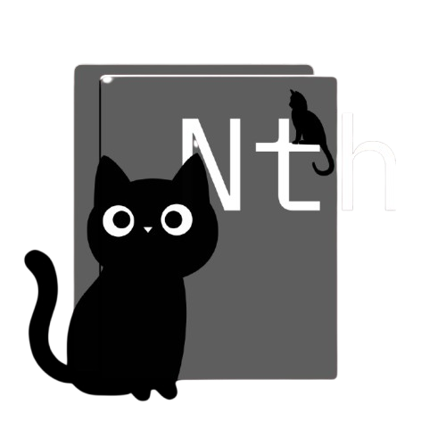

<p align="center">
  
</p>

<h1 align="center">Notohiis</h1>

<p align="center">
  Simples por padrão. Poderoso quando você precisa.
</p>

<p align="center">
  <sub>Python · Textual + CustomTkinter · v0.4-alpha</sub>
</p>

<p align="center">
  <a href="#instalação">Instalação</a> ·
  <a href="#plugins">Plugins</a> ·
  <a href="#estrutura">Estrutura</a> ·
  <a href="#documentação">Documentação</a>
</p>

<br>

Notohiis é um editor de texto minimalista, rápido e modular, feito em Python — para quem valoriza foco e controle total sobre a própria ferramenta.

<br>

## Filosofia

O editor deve desaparecer para que você brilhe.

- **Minimalismo intencional** — interface limpa, sem ruído visual.
- **Modularidade** — core separado da interface.
- **Extensibilidade** — o que faltar, você cria com plugins em Python.

Você decide o quanto de poder quer expor.

<br>

## Recursos

- Temas completos via JSON
- Sistema de plugins com carregamento dinâmico
- GUI (CustomTkinter) e TUI (Textual), mesma lógica de base
- Git nativo, syntax highlighting, múltiplas linguagens
- Leve mesmo com vários plugins carregados

<br>

## Capturas de tela

<p align="center">
  
  <br><sub>Interface principal</sub>
</p>

<p align="center">

  <br><sub>Modo terminal (TUI)</sub>
</p>

<p align="center">
  
  <br><sub>Plugins</sub>
</p>

<br>

## Instalação

```bash
git clone https://github.com/John-BrenoF/notohiis.git
cd notohiis
chmod +x notohiis.sh
./notohiis.sh
```

Na primeira execução, o script cria o alias `nth`, para abrir o editor de qualquer lugar:

```bash
nth
```

<br>

## Plugins

Coloque um arquivo Python em `plugins/` e ele é carregado automaticamente. Nada de configuração extra.

Alguns exemplos:

- **Auto-close** — fecha parênteses, colchetes e aspas
- **Color Preview** — visualiza cores hexadecimais em tempo real
- **Git Status** — status do Git na sidebar
- **Markdown Live Preview** — pré-visualização em tempo real
- **Zen Mode** — remove tudo que não é o texto

<br>

## Estrutura

```text
notohiis/
├── core/      lógica principal e sistema de plugins
├── ui/        interface gráfica (CustomTkinter)
├── tui/       interface de terminal (Textual)
├── plugins/   seus plugins entram aqui
├── themes/    temas em JSON
├── midia/     logos e imagens
├── docs/      documentação
└── notohiis.sh
```

<br>

## Documentação

- [docs/README.md](docs/README.md) — visão geral e ponto de partida
- [docs/arquitetura.md](docs/arquitetura.md) — como core, UI, TUI e plugins se conectam
- [docs/GUIA_COMPLETO.md](docs/GUIA_COMPLETO.md) — guia detalhado de uso, temas e plugins

<br>

<p align="center">
  <sub>Notohiis v0.4-alpha — "Frango com batata doce" Edition</sub><br>
  <sub>Feito com Python+café por você.</sub>
</p>
